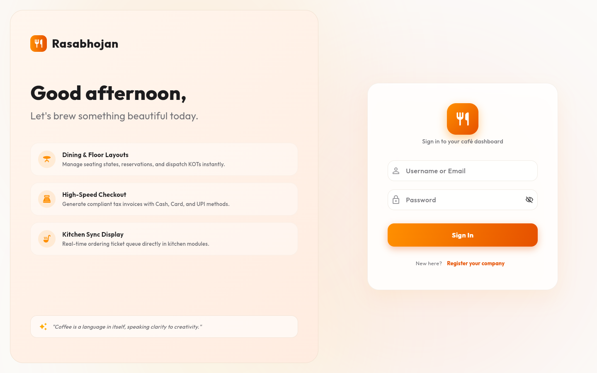
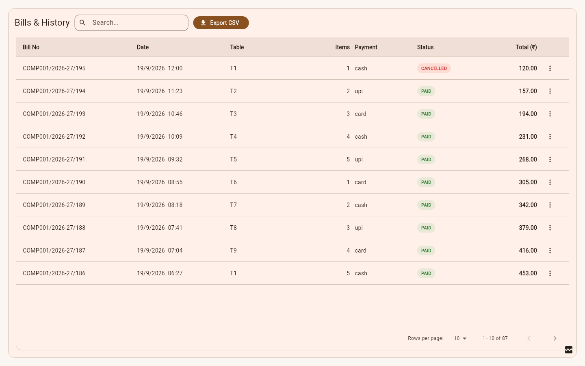
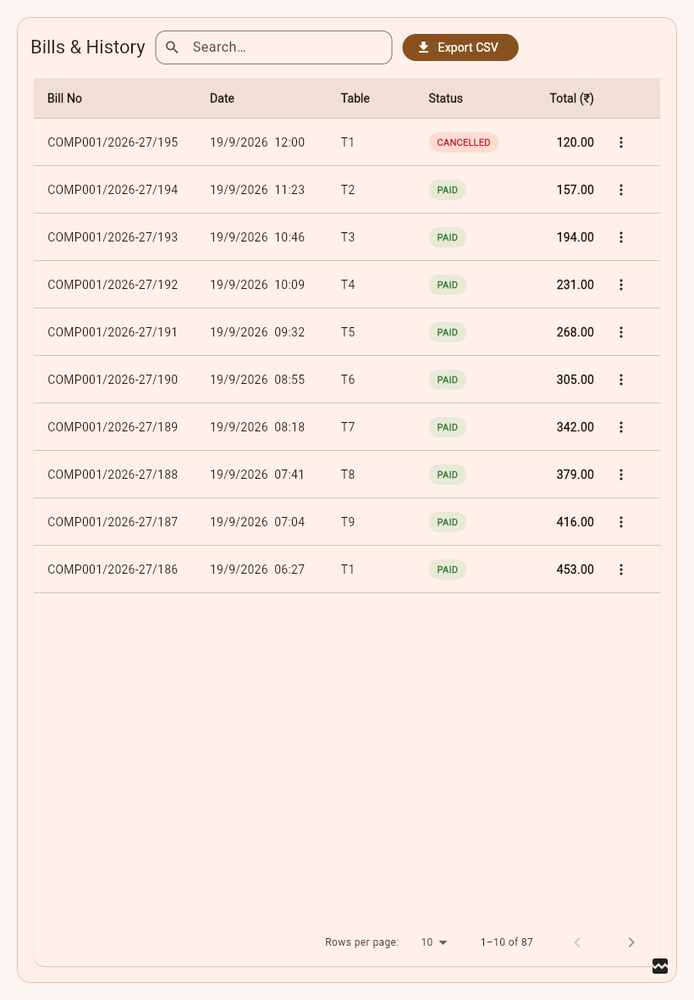
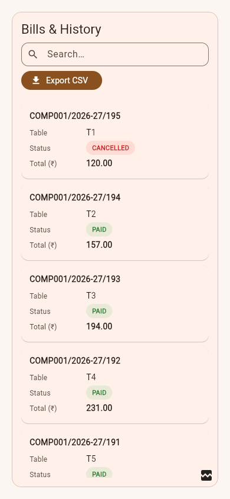

# RasaBhojan — Web (browser / desktop) version: implementation plan

**Goal:** run the app as a website on desktop browsers, with the layout a website user expects — a permanent
side menu, card grids that use the width, **data tables** (sortable, searchable, paginated, exportable) where a
website would show a table, proper buttons/dialogs/keyboard behaviour — while the phone/tablet app keeps working.

> Interpretation: "web view" = the **Flutter Web build** of this app, made desktop-grade. It is not an in-app `WebView`.
> "Datacell" = data-table / data-grid.

**Status (2026-09-19):** plan + a compiled, browser-tested prototype. **No app code has been changed.**
Companion to `../backend-migration/PLAN.md` (Node + MySQL), which this plan depends on for a *public* release.

---

## 0. Read this first

1. **It already builds and runs on web.** `flutter build web --release` succeeds (33 s). The login screen already has a
   proper desktop layout (screenshots below). So this is *adaptation*, not a port.
2. **But three things are broken on web today, and I proved each in a real browser** (§1.2): the "is the network up?" check
   that guards every save in *User Master, Table Master and My Profile* always answers **no**; the picked-image preview
   fails to render; and the image file-extension logic yields garbage. These are 2 days of fixes (Phase W0).
3. **Do not publish a Supabase-mode web build to the internet.** A web bundle hands the anon key to every visitor in one
   click, and that key can read/modify most of your tables (backend plan §1.3 #1); the app also caches the whole user row,
   *plaintext password included*, in the browser's `localStorage`. Test on localhost/LAN in Supabase mode; ship publicly on the Node API.
4. **The navigation is phone-style.** A slide-out `Drawer` on every screen (35 references, no `NavigationRail`), and
   no URLs at all: 62 `Navigator.push` calls, `go_router` is in `pubspec.yaml` but used **0** times. On web that means no
   deep links, the browser Back button leaves the app, and refresh always lands on the first module.
5. **Tables need paging first.** The live Supabase project caps every query at **1,000 rows** (`max_rows: 1000`, verified) and
   `getBills` has no range — so a data table (or today's reports) over a busy café's bills would silently show only the first 1,000.
6. Plan: 9 phases, ≈ 37 developer-days (rough). The reusable table widget already exists as a tested prototype (§3.3).

| Phase | What | Rough size* |
|---|---|---|
| W0 | Web blockers, packaging basics, dead weight | 2 d |
| W1 | Responsive foundation: breakpoints, app shell, grids, buttons, adaptive dialogs | 3 d |
| W2 | Routing: real URLs, browser Back/refresh, permission guards | 3 d |
| W3 | Data-table kit (`AppDataTable`) + paging contract | 4 d |
| W4 | Batch 1 screens: Bills/reports, Users, Items, Variants, Tables master, Company | 7 d |
| W5 | Batch 2 screens: POS (3 variants), Tables & KOT, Kitchen | 9 d |
| W6 | Batch 3 screens: Stock (6), Owner dashboard, Profile, Registration | 3 d |
| W7 | Web ops: printing, PWA/caching, hosting, CORS/cookies, image thumbnails | 3 d |
| W8 | QA (goldens, browser e2e, browsers matrix) + rollout | 3 d |

\* one developer, rough. W0–W3 have no dependency on the backend work; a *public* release does (§4.4).

---

## 1. What the investigation found

### 1.1 What I ran (evidence base)

| Check | Result |
|---|---|
| `flutter build web --release` on the real app | **succeeds**, 33 s; `main.dart.js` **4.7 MB** (**1.37 MB gzipped**); wasm dry-run passes |
| Real app in Edge at 1440 / 820 / 390 px (login screen only — I did not log in, so nothing was written to your DB) | renders correctly; desktop 2-pane at > 850 px, single card on phone → `img/current-login-*.png` |
| Static scan of `lib/` (27k lines, 26 screens) | numbers below |
| Throw-away spike project on **your** Flutter 3.35.6 with `data_table_2` and browser probes | compiles, runs, probes below → `prototype/` |
| `pub add --dry-run` on your SDK | `data_table_2` resolves to **2.7.2** (3.0.0 needs Flutter ≥ 3.47), `two_dimensional_scrollables` 0.5.2, `file_saver` 0.3.1 |
| Live project: PostgREST config; storage sizes; image headers | `max_rows: 1000`; item images **avg 471 KB, max 1.35 MB, 19.8 MB total**, `Cache-Control: no-cache`, `Access-Control-Allow-Origin: *` |



### 1.2 Web blockers — proven by running a release build in a browser

| # | Problem | Proof | Where | Effect on web |
|---|---|---|---|---|
| B1 | `_hasNetwork()` calls `InternetAddress.lookup(...)` inside `catch (_) { return false; }` | probe: `THREW … Unsupported operation: InternetAddress.lookup` | `user_master_screen.dart:104`, `table_master_screen.dart:52`, `my_profile_screen.dart:79` | `_checkNetworkAndWarn()` **always fails** → every save/force-logout in those three screens shows "No internet connection" |
| B2 | Picked-image preview uses `FileImage(File(x.path))` / `Image.file(File(x.path))` | probe: constructs fine in release, but **rendering** throws `Unsupported operation: _Namespace` (the spike's broken-image icon, bottom-right of the table screenshots) | `item_master_screen.dart:853`, `item_variant_screen.dart:230`, `my_profile_screen.dart:455`, `user_master_screen.dart:1090` | preview is blank/error (the *upload* still works — it already uses `readAsBytes()`) |
| B3 | Extension from `XFile.path.split('.').last` | probe: on web `path` is a `blob:` URL → `"blob:http://localhost:8099/6f1c…"` | `my_profile_screen.dart:163` | wrong `contentType` on avatar upload from My Profile (the other screens correctly use `.name`) |
| B4 | Offline detection matches `SocketException` / strings such as `'failed host lookup'` | code: browsers raise `ClientException` / "Failed to fetch" instead | `api_helper.dart:57`, `network_error_view.dart:9`, `modern_pos_screen.dart:1166` (3 copies) | network failures are shown as generic errors, not "No internet" + Retry |

`dart:io` *imports* compile fine (the build succeeds); only these **runtime calls** fail. That keeps W0 small.

### 1.3 Gaps for a website-quality UI (ranked)

| # | Gap | Evidence |
|---|---|---|
| G1 | **Phone-style navigation.** `Drawer` everywhere, no rail/sidebar, sidebar content rebuilt on module switch (`body: modules[i].screen`) | `home_shell.dart:173-177`; 35 `Drawer` refs, 0 `NavigationRail` |
| G2 | **No URLs / history.** Back button, refresh, bookmarks, "open in new tab" don't work | 62 `Navigator.push/pop`, 13 `MaterialPageRoute`, `go_router` 17.1.0 locked but unused |
| G3 | **Breakpoints are scattered literals**, inconsistent: 420, 600, 700, 720, 800, 850, 1100, 1200, 1400 across ~10 files; `MediaQuery.of(context).size` ×18 vs `sizeOf` ×2 | grep |
| G4 | **Grids don't use width.** Tables floor: fixed **3** columns max; Quick Bill: fixed 4; POS: fixed counts up to 6; Kitchen: up to 5. On a 1920 px monitor the table cards are ~600 px wide. No max content width anywhere | `tables_screen.dart:284`, `quick_bill_screen.dart:154`, `modern_pos_screen.dart:1030`, `kitchen_screen.dart:608` |
| G5 | **Lists are cards, not tables.** Only 2 `DataTable`s exist (stock dashboard, staff consumption). Bills, users, items, variants, tables, materials, registrations are card lists with no sort/filter/page/export | 66 `Card(`, `DataTable` ×2 |
| G6 | **Data volume.** `getBills` = whole date range, unpaged, with nested items; the year comparison fetches two years. Supabase truncates at 1,000 rows | `report_provider.dart:350,359`; `max_rows: 1000` |
| G7 | **POS cart is a slide-out drawer** (340 px) even on wide screens; Classic POS has a fixed 340 px cart | `modern_pos_screen.dart:225`, `classic_pos_screen.dart:169` |
| G8 | **Desktop interaction is thin:** 4 tooltips, 0 `SelectionArea` (can't select/copy a bill number or OTP), 0 explicit `Scrollbar`, 11 bottom sheets that will stretch across the full window, shortcuts only in a few places | grep |
| G9 | **Buttons sized for thumbs:** `padding 24×16` on every button (≈ 52 px tall); no `visualDensity` set | `app_theme.dart:53,67,174,188` |
| G10 | **Fonts fetched at runtime** (543 `GoogleFonts.*` calls) → flash of fallback font on first load, breaks offline/PWA | grep |
| G11 | **Dead weight:** `assets/rasabhojan.png` is **7 MB**, declared in `pubspec.yaml`, referenced nowhere in `lib/` | `du`, grep |
| G12 | **Menu images are full-size originals** (avg 471 KB, up to 1.35 MB) shown as ~120 px tiles, `no-cache` | live storage query |
| G13 | **Web metadata is the Flutter template:** title `cafe`, description "A new Flutter project.", `orientation: portrait-primary` in the manifest, no loading splash | `web/index.html`, `web/manifest.json` |
| G14 | **Thermal printing.** Bills print A4 via `Printing.sharePdf` (works on web = file download). Browsers cannot print silently to an 80 mm thermal printer | `bills_screen.dart:1716,1961` |
| G15 | **Kitchen screen `setState`s every second** to tick durations, rebuilding the whole grid | `kitchen_screen.dart:30` |
| G16 | **Push (FCM) is not configured for web** — already guarded (`Firebase.initializeApp()` throws → caught), so the app runs; owner OTP push just won't arrive in a browser | `push_service.dart:64` |

---

## 2. Target UX ("what the website should feel like")

### 2.1 Window classes — one source of truth

Material 3 window-size classes replace every literal (`context.windowClass`, implemented in `prototype/app_data_table.dart`):

| Class | Width | Navigation | Page layout | Content max width |
|---|---|---|---|---|
| **compact** | < 600 | bottom bar / drawer (as today) | single column, cards | full |
| **medium** | 600–839 | `NavigationRail` (72 px, icons + tooltip) | 1–2 columns; table with fewer columns | full |
| **expanded** | 840–1199 | rail, or collapsible sidebar | 2 columns; POS: menu + persistent cart | 1200 |
| **large** | ≥ 1200 | permanent sidebar (256 px, collapsible to 72) + top bar | 3 panes where useful; master-detail | 1440 (dashboards) · 1200 (tables) · 720 (forms) |

Density follows the **input device**, not width: `VisualDensity.adaptivePlatformDensity` (compact on desktop browsers,
standard on tablets/phones), and touch targets stay ≥ 48 px whenever the pointer is touch.

### 2.2 App shell

```
┌ top bar: [☰ on compact] · page title · global search · company/branch · user menu ────────────────┐
├─ sidebar ──────┬─ page ───────────────────────────────────────────────────────────────────────────┤
│ POS Terminal   │  page header: title · filters · primary action (right-aligned)                    │
│ Tables & KOT   │  content (max-width by page type)                                                  │
│ Bills          │                                                                                    │
│ Kitchen        │                                                                                    │
│ ─ Masters ─    │                                                                                    │
│ Users · Items… │                                                                                    │
│ Stock · Profile│                                                                                    │
└────────────────┴────────────────────────────────────────────────────────────────────────────────────┘
```
Items and permission gating are exactly today's drawer entries (`Tables & KOT`, `Bills & History`, `Kitchen Monitor`,
`Company/Table/User Master`, `Item Group`, `Item Variant`, `Stock & Inventory`, `My Profile`, `Logout`); waiter and kitchen
roles keep their dedicated single-module shells.

### 2.3 Cards

* **Auto-fit grids** — `SliverGridDelegateWithMaxCrossAxisExtent` (min tile width) replaces every fixed `crossAxisCount`:
  POS item 200–260 px, floor table 220–260, KOT 320–360, KPI 240. A 1920 px window then shows the right number of tiles, not 3 giant ones.
* **Max content width** per page type (table above) via one `PageBody` wrapper; centred.
* Cards get **hover elevation + pointer cursor** (`InkWell` already gives the cursor), keyboard focus ring, and a consistent
  spacing scale 4/8/12/16/24/32 (`AppSpacing`), radius 12/16 as in the current theme.

### 2.4 Buttons

| Type | Use | Spec |
|---|---|---|
| Primary (filled, orange gradient as today) | one per page/dialog — Save, Checkout, Add | 40 px high on pointer devices / 48 touch; right-aligned in headers & dialog footers |
| Secondary (outlined) | Cancel, Export, Filter | same size |
| Tertiary (text) | inline links, "Clear" | |
| Icon button | row actions, close | **always a tooltip**, 40×40 hit area |
| Destructive | Cancel bill, Delete, Force logout | red, always confirmed |
| States | hover, focus-visible, pressed, disabled, **loading** (spinner + disabled, prevents double-tap — the app already guards with `_isLoading`) | |
| Keyboard | `Enter` submits the focused form, `Esc` closes dialogs, `Ctrl/Cmd+S` saves editors, `/` focuses search, `F2` opens POS search | |

### 2.5 Dialogs & sheets

The 11 `showModalBottomSheet` calls become `showAdaptiveSheet(...)`: bottom sheet on compact; **centred dialog (max 560 px)** or
**right-side panel (400–480 px)** on wider windows — never a full-width sheet on a 1920 px screen.

### 2.6 Forms

Two-column sections from *expanded*, a sticky action bar, browser autofill on login (`AutofillGroup` + `autofillHints`), Enter to submit,
`FocusTraversalGroup` for Tab order, `SelectionArea` around read-only text (bill numbers, OTPs).

### 2.7 Master-detail for the admin masters

Users, Items, Variants, Tables, Materials: **table on the left (or top), editor in a right panel** at ≥ 1200 px; on compact
the editor stays a pushed screen (as today). This removes the "toggle `_isEditing` inside one giant screen" pattern.

---

## 3. Data tables ("datacell")

### 3.1 Table or cards?

| Use a **data table** (scan · sort · compare · export) | Keep **cards** (glance · touch · status) |
|---|---|
| Bills & history, Users, Item groups, Item variants, Table master, Raw materials, Stock levels, Staff consumption, Owner registrations, (later) Audit log | POS item grid, Tables floor plan, KOT board, KPI tiles, dashboards/charts |

Every table **degrades to cards below 720 px** (proved in the prototype), so the phone app keeps its current feel.

### 3.2 Library choice (verified against your SDK)

| Option | Fit | Verdict |
|---|---|---|
| **`data_table_2`** | drop-in over Flutter's `DataTable`; sticky header, responsive column sizes, `PaginatedDataTable2` and `AsyncPaginatedDataTable2` (server paging). Resolves as **2.7.2** on Flutter 3.35.6 (3.0.0 needs ≥ 3.47) | **Recommended.** Pin `2.7.2`; upgrade with the SDK |
| Flutter `PaginatedDataTable` | zero dependency; no sticky header, weak column sizing | fallback if you want no dependency |
| `two_dimensional_scrollables` (`TableView`) 0.5.2 | Flutter-team, virtualised, but no sort/selection/paging built in | only if a grid must show > 10k rows at once |
| `syncfusion_flutter_datagrid` | very rich | **commercial licence** (community licence has revenue/seat limits) — avoid unless you accept that |
| `pluto_grid` 8.1.0 | Excel-style editing | overkill; heavy |

The wrapper (`AppDataTable`) is the only place that imports the library (`ColumnSize` is re-exported), so swapping later is a one-file change.

### 3.3 The prototype (compiled and browser-tested — `prototype/`)

```dart
AppDataTable<Bill>(
  title: 'Bills & History',
  rows: bills,
  searchText: (b) => '${b.no} ${b.table} ${b.mode} ${b.status}',
  toolbar: [FilledButton.icon(onPressed: exportCsv, icon: const Icon(Icons.download), label: const Text('Export CSV'))],
  actions: [AppRowAction('View', Icons.visibility_outlined, open), AppRowAction('Print', Icons.print_outlined, print),
            AppRowAction('Cancel', Icons.block, cancel)],
  onRowTap: open,
  columns: [
    AppColumn(label: 'Bill No',  value: (b) => b.no,    size: ColumnSize.L),
    AppColumn(label: 'Date',     value: (b) => b.date,  minWindow: WindowClass.medium),     // hidden on phones
    AppColumn(label: 'Items',    value: (b) => b.items, numeric: true, minWindow: WindowClass.expanded),
    AppColumn(label: 'Status',   value: (b) => b.status, cell: (b) => statusChip(b.status)),
    AppColumn(label: 'Total (₹)', value: (b) => b.total, numeric: true),
  ],
)
```

| 1440 px — sortable, paginated, row actions | 820 px — columns drop out | 390 px — cards |
|---|---|---|
|  |  |  |

What it already does: sticky header, click-to-sort, search, page size 10/25/50, status-chip cells, ⋮ row menu with tooltip, per-column
`minWindow`, card fallback, empty/loading states. **What Phase W3 adds:** server-side paging (`AsyncPaginatedDataTable2`),
server-side sort/filter/search, CSV/PDF export, column chooser, density toggle, skeleton loading, multi-select + bulk actions,
keyboard navigation, and golden tests.

### 3.4 Paging contract (needed because of the 1,000-row cap)

```dart
class PageRequest { final int page, size; final String? sortBy; final bool asc; final String? q; final Map<String,String> filters; }
class Paged<T>    { final List<T> rows; final int total; }
// new PosBackend methods (additive; existing ones untouched):
Future<Paged<Map<String,dynamic>>> getBillsPage(String companyId, PageRequest r, {DateTime? from, DateTime? to});
```
* **Supabase mode:** PostgREST `.range(from, to)` + `count: exact`, `.order()`, `.ilike()` — stays under the 1,000 cap per page.
* **Node mode:** `GET /v1/bills?from&to&page&size&sort&q` (adds `sort`/`q` to the backend plan §4.2 row).
* Reports/charts keep aggregating, but must move to **server-side aggregates** (`/v1/reports/summary`) before a busy café uses the
  year view — today the year view downloads two years of bills.

### 3.5 Table catalogue (columns → actions)

| Screen | Columns | Row actions | Filters |
|---|---|---|---|
| **Bills** | Bill no · Date · Table/Cover · Items · Payment · Status · Total | View, Print/PDF, Edit, Cancel | date range, status, payment, table, search |
| **Users** | Code · Name · Username · Role · Status · Last login | Edit, Force-logout, Deactivate | role, status |
| **Item groups** | Code · Name · Section · HSN/GST · Base rate · Variants · Active | Edit, Delete | section, active |
| **Item variants** | Name · Group · Rate (effective) · Food type · Default · Available | Edit, Set default, Delete | group, food type, availability |
| **Tables** | No · Section · Seats · Active · Occupied | Edit | section, active |
| **Raw materials** | Name · Unit · Stock · Reorder · Cost · Low-stock flag | Edit, Recipe usage, Deactivate | low-stock |
| **Stock ledger / staff consumption** | Staff · Material · Consumed · Unit | — | date range, staff |
| **Owner registrations** | Company · Owner · OTP · Status · Created | Approve | status |

---

## 4. Engineering work by concern

### 4.1 Blocker fixes (Phase W0) — exact recipes

* **B1 / B4 — one network helper.** Delete the three `_hasNetwork()` pre-checks (they duplicate what `safeApiCall` already reports)
  or make them `kIsWeb ? true : lookup(...)`. Add one `isNetworkError(Object e)` in `api_helper.dart` covering `SocketException`,
  `http.ClientException`, `TimeoutException` and the browser strings (`Failed to fetch`, `XMLHttpRequest error`); make `network_error_view.dart`
  and `modern_pos_screen.dart` call it instead of their own copies.
* **B2 — image previews without `dart:io`.** Keep the picked file's bytes and name in state (`Uint8List _pickedBytes; String _pickedName`), preview with
  `Image.memory` / `MemoryImage`, upload those same bytes. Remove `dart:io` from the 6 files that import it (item_master, item_variant,
  my_profile, user_master, table_master, modern_pos).
* **B3 — extension:** `_pickedName.split('.').last.toLowerCase()` (fall back to `XFile.mimeType`).
* Remove `assets/rasabhojan.png` (7 MB, unused) from `pubspec.yaml`. (`rasabhojan_icon.png` isn't in `assets:`; it feeds the launcher-icon tool only.)
* Bundle **Inter** as an asset and set `GoogleFonts.config.allowRuntimeFetching = false` for release — no font flash, works offline.
* `web/`: real title/description, `theme-color #FF8A00`, manifest `orientation: any`, `lang`, brand icons, a CSS loading splash shown until Flutter boots.

### 4.2 Routing (Phase W2)

`go_router` 17.1.0 is already locked. Plan: `usePathUrlStrategy()` (from `flutter_web_plugins`, no extra package);
`StatefulShellRoute.indexedStack` for the main modules (keeps each module's state — fixes the rebuild-on-switch behaviour);
routes `/login`, `/pos`, `/tables`, `/tables/:id`, `/bills`, `/bills/:id`, `/kitchen`, `/admin/users`, `/admin/items`, `/admin/variants`, `/admin/tables`,
`/admin/company`, `/admin/stock/...`, `/profile`, `/owner`; a `redirect` that reads `authStateProvider` + `permissionsProvider` (same rules as
`home_shell`'s gating, incl. waiter-only and kitchen-only shells and the owner dashboard). **Migrate incrementally:** first wrap the existing screens as route
builders (no screen rewrite), then swap the drawer's `Navigator.push(MaterialPageRoute…)` for `context.go`. Dialogs/sheets keep `Navigator`. Host must rewrite unknown paths to `index.html` (§4.7).

### 4.3 Desktop interaction polish (Phase W1, applied per screen)

`ScrollConfiguration` with mouse in `dragDevices` (Flutter's default excludes the mouse, so horizontally scrolling chip rows can't be dragged) and visible
`Scrollbar`s on nested scrollables; tooltips on every icon button; `SelectionArea` on read-only text; hover states; right-click row menu on tables;
`Shortcuts`/`Actions` (§2.4); browser tab title per route (`Title` widget); `TextInputAction`s and autofill.

### 4.4 Authentication & security on the web

* **Public web ⇒ Node API.** Same reason as §0.3. The backend plan already moves login server-side (argon2id, JWT) and enforces tenant isolation.
* **Tokens:** on web keep the **access token in memory** and the **refresh token in an `HttpOnly; Secure; SameSite=Lax` cookie** set by the Node API
  (`Path=/v1/auth`), sent only to `/auth/refresh`. `flutter_secure_storage` on web is just encrypted `localStorage`, so it doesn't help here. On page load the app
  calls `/auth/refresh` to restore the session (a splash shows meanwhile) — this changes `AuthNotifier`'s bootstrap for web only.
* **Same origin if possible:** serve the web build and reverse-proxy `/v1` to Node under one domain → no CORS, cookies "just work". Otherwise `@fastify/cors`
  with an explicit allow-list + `credentials: true`.
* **CSRF:** cookie is only honoured on `/auth/refresh`, which also requires a custom header + `Origin` check; state-changing calls use the bearer header, not cookies.
* **Session rule:** the existing single-device rule (`is_login`/`last_login`) is per user, not per tab — two tabs on one browser are one session.
* **Supabase mode on web (internal testing only):** additionally strip `password` from the profile JSON before caching it (`UserProfile.fromJson` never reads it) — 5-minute change, listed in the backend plan's optional fixes.

### 4.5 Images, fonts, bundle, performance (W0, W7)

| Item | Action | Why |
|---|---|---|
| Menu images | Node upload pipeline generates **320 px WebP thumbnails** (`sharp`) + keeps the original; content-hash filenames; `Cache-Control: public, max-age=31536000, immutable`; CORS `Access-Control-Allow-Origin` on `/uploads` (CanvasKit fetches image bytes; Supabase already sends `*`) | 471 KB avg → ~15 KB per tile; no revalidation |
| POS grid | `CachedNetworkImage(memCacheWidth: …)` sized to the tile | decode cost |
| Bundle | remove the 7 MB PNG; `deferred` imports for reports/charts (`fl_chart`), PDF/printing and stock screens; measure `--wasm` (Skwasm) in W7 | first load = 1.37 MB gz JS + CanvasKit; defer what login doesn't need |
| Kitchen ticking | replace the 1-second `setState` with a per-card `ValueListenable`/ticker so only the clock text rebuilds | G15 |
| `MediaQuery` | `MediaQuery.of(context).size` → `sizeOf` (18 places) | fewer needless rebuilds |
| Budget | gate in CI: first-load JS ≤ 1.5 MB gz, LCP ≤ 3 s on a mid laptop over cable | |

### 4.6 Printing

* **A4 / PDF invoices:** already work — `Printing.sharePdf` downloads on web; add `Printing.layoutPdf` for a browser print preview.
* **80 mm thermal receipts:** a browser can only open the print dialog (`PdfPageFormat.roll80`); it **cannot print silently** and margins/scale depend on the driver.
  Options: (a) browser print dialog — works everywhere, one click more; (b) a small **local print agent** on the POS PC (e.g. QZ Tray or a tiny Node service) that
  receives ESC/POS/PDF from the page — silent printing, needs an install; (c) WebUSB/WebSerial — Chrome/Edge only, HTTPS + user gesture.
  **Default: (a) now, (b) when a café asks for one-click KOT/bill printing.**

### 4.7 Packaging, caching, hosting (W7)

* `flutter build web --release --pwa-strategy=none` (flag exists in 3.35.6) — the default service worker caches aggressively and can leave a POS on an old
  build after a deploy; if you want offline shell later, add an "update available" prompt first.
* Host: any static host/Caddy/nginx with **SPA fallback** (`try_files $uri /index.html`), gzip/brotli, `index.html`/`flutter_bootstrap.js` `no-cache`,
  hashed assets `immutable`, and a CSP (`--csp` build flag if you tighten it). CanvasKit is fetched from `gstatic.com` by default; use
  `--no-web-resources-cdn` to self-host it if your network blocks that.
* Browsers: latest Chrome, Edge, Firefox, Safari (CanvasKit). Treat `--wasm` as an opt-in until measured on Safari.

### 4.8 Push on web

Out of scope for the first release (the app already degrades gracefully). If wanted: Firebase web config + VAPID key + `firebase-messaging-sw.js`;
the owner dashboard can instead poll `/owner/registrations` every 30 s in a browser.

---

## 5. Screen-by-screen plan

Sizes are lines today (a rough proxy for risk).

| Screen (lines) | Today | Web target | Phase |
|---|---|---|---|
| Login (960) | 2-pane > 850 ✓ | keep; autofill + Enter; already good | W0/W1 |
| **Shell** `home_shell` (723) | drawer only | sidebar/rail + top bar; go_router shell | W1–W2 |
| **Modern POS** (2,241) | grid up to 6 cols, cart in 340 px end-drawer | ≥ 840: menu + **persistent cart panel (360–420 px)**; ≥ 1200: category rail + grid + cart; compact unchanged | W5 |
| Classic POS (676) | fixed 340 px cart | same 2/3-pane rule | W5 |
| Quick Bill (545) | fixed 4 cols | auto-fit grid, centred max 900 | W5 |
| **Tables & KOT** (4,166 — 162 responsive branches) | 3-col floor grid | **split the file first**, then floor grid (auto-fit) + right **detail panel** (covers, order summary, checkout) as master-detail ≥ 1200 | W5 |
| **Kitchen** (1,394) | grid up to 5 cols, 1 s rebuild | **board with columns** (New · Preparing · Ready) ≥ 1200; ticker fix | W5 |
| **Bills & reports** (2,495) | KPI + charts (2-col > 600) + card list, bottom-sheet editor | KPI row (auto-fit) + charts + **server-paged data table** + side-panel detail/edit | W4 |
| Company Master (983) | single form | 2-column sections, sticky save bar | W4 |
| Table Master (1,127) | card list | data table + edit panel | W4 |
| **User Master** (2,104) | card list + editor screen | data table + edit panel; permissions as a switch grid | W4 |
| Item Group (967) / Item Variant (1,193) | list + editor | two data tables + edit panel; image preview fixed | W4 |
| Stock: dashboard (311), raw material (615), recipe (450), day-end (441), shift handover (499), staff consumption (270) | 2 `DataTable`s + cards | migrate to `AppDataTable`; forms 2-column | W6 |
| Owner dashboard (698) | card list | data table + Approve | W6 |
| My Profile (1,276) | phone layout | 2-column | W6 |
| Registration ×3 (222–235) | fixed 420/460 px cards | `maxWidth` constraint (already fine) | W6 |

---

## 6. Phases in detail — every phase ends with exit criteria

### W0 — Web blockers & basics  *(2 d)*
§4.1 in full, plus CI step `flutter build web --release`.
**Exit:** in Chrome at phone width every existing flow behaves like mobile; browser console shows no `Unsupported operation`; saves in User/Table/Profile work; image pick → preview → upload works; first-load JS ≤ 1.5 MB gzipped (CanvasKit's wasm is fetched separately).

### W1 — Responsive foundation  *(3 d)*
`WindowClass` (from the prototype), `AppSpacing`, `PageBody` (max width), `AutoFitGrid`, `AppScaffold` shell (sidebar / rail / drawer — still `Navigator` inside),
`showAdaptiveSheet`, `ScrollConfiguration`, `adaptivePlatformDensity`, button/theme adjustments, tooltip rule; replace the literal breakpoints in ~10 files and `MediaQuery.of(...).size` ×18.
**Exit:** golden tests of the shell at 390 / 820 / 1440; no literal breakpoint left in `lib/` (grep gate).

### W2 — Routing  *(3 d)*  — §4.2.
**Exit:** refresh keeps you on the same page; Back/Forward walk the history; opening `/bills` without `canViewReports` redirects; drawer entries use `context.go`.

### W3 — Data-table kit  *(4 d)*
Productionise the prototype (§3.3), add `getBillsPage` + `PageRequest/Paged` to `PosBackend` (Supabase via `.range`), CSV export (`file_saver` 0.3.1 resolves on your SDK — verify it on web, or use the transitive `package:web` blob download to avoid a dependency), tests.
**Exit:** a 5,000-row synthetic bills set pages, sorts and searches correctly *server-side* under the 1,000-row cap; golden tests at 3 widths.

### W4 — Batch 1 screens  *(7 d)* — Bills+reports, Users, Item groups, Variants, Table master, Company (§5).
**Exit:** each screen works at 390/820/1440; existing behaviour and permissions unchanged (regression checklist in §7).

### W5 — Batch 2 screens  *(9 d)* — POS ×3, Tables & KOT (split first), Kitchen board.
**Exit:** a waiter can take an order, send KOT, and a cashier can settle it on a 1440 px window without opening a drawer; kitchen board runs a full shift without jank.

### W6 — Batch 3 screens  *(3 d)* — Stock ×6, Owner, Profile, Registration.

### W7 — Web ops  *(3 d)*
Printing default (a) + agent spike (b); `--pwa-strategy=none`; hosting config + SPA fallback + cache headers + CSP; same-origin proxy or CORS; refresh-cookie flow with the Node API;
thumbnails pipeline; optional `--wasm` benchmark; error reporting.
**Exit:** deployed to a staging domain over HTTPS; login persists across refresh via the cookie; Lighthouse performance ≥ 80 on the POS route.

### W8 — QA & rollout  *(3 d)*
Golden tests (390/820/1440 for every page template), browser e2e with Playwright (URL, resize, Back, refresh, console-error gate) on Chrome/Edge/Firefox/Safari, keyboard-only pass, touch pass on an iPad/Android tablet in the browser, accessibility (semantics enabled) spot-check, staged rollout to one café.

---

## 7. Testing & regression checklist

Run the same **manual smoke list as the backend plan §8** on the web build in both modes, plus web-specific items: deep-link into each route; refresh on each route; Back/Forward;
resize 1440 → 390 while a table/cart/editor is open (state preserved); keyboard-only checkout; copy a bill number; print a PDF; upload an image; two tabs open; log in on phone + web (existing kick-out rule).
Automated: goldens per page template, `AppDataTable` unit tests (sort/search/paging/export), Playwright smoke (I used the same approach — Edge driven by `puppeteer-core` — for the screenshots here).

## 8. What was verified, and what was not

**Verified by running it:** the web release build of the real app (size, compile); the login screen at 3 widths; the three web blockers (B1, B2, B3) as probes in a release build in Edge; the prototype table on
Flutter 3.35.6 at 1440/820/390 (sort/paging/columns/cards render); `pub` resolution on your SDK; `max_rows: 1000`; image sizes and CORS headers.

**Not verified — be aware:**
* **I did not view any post-login screen** (POS, tables, bills…): I won't log in and write `is_login` to your production database. Their layouts are assessed from code; W1 should start with screenshots of each.
* The prototype's sort/search/paging were rendered but not exercised by automated interaction. `AsyncPaginatedDataTable2` (server paging) exists in 2.7.2 but I compiled only the client-paged `PaginatedDataTable2`. `file_saver`, cookie-based refresh, `--wasm`, Safari and printer behaviour are untested.
* Effort figures are estimates; the 4,166-line `tables_screen.dart` is the biggest unknown.
* Everything in §4.4/§4.7 depends on the Node backend (its plan §4.5) being built.

## 9. Decisions I made so you didn't have to answer questions (change any)

1. Target = **Flutter Web, desktop-grade**, keeping the mobile app; CanvasKit first, `--wasm` opt-in later.
2. **`data_table_2` 2.7.2** behind an app-owned `AppDataTable` wrapper; cards remain for touch/glance screens.
3. Material 3 window classes (600/840/1200) as the only breakpoints; density by input device.
4. **`go_router`** (already a dependency) with `StatefulShellRoute`; incremental migration.
5. Public web only on the **Node API**; Supabase-mode web is localhost/LAN testing.
6. Web refresh token in an **HttpOnly cookie**, access token in memory.
7. Printing: browser print/PDF now; local print agent when requested.
8. `--pwa-strategy=none` until an update-prompt exists.
9. Menu images become thumbnails at upload (Node) — an additive change in the backend plan's uploads module.
